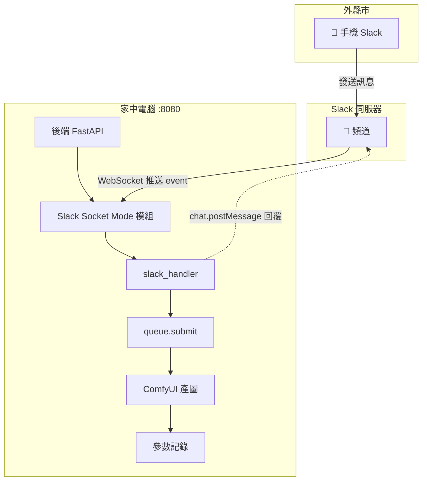
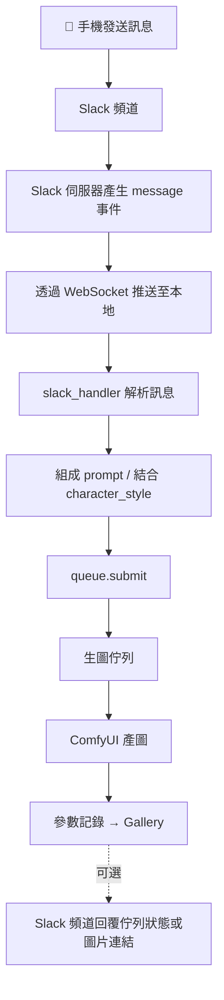

# AI 自動化出圖系統

> 資料夾監聽自動 .txt · LoRA 訓練觸發 · ComfyUI 產圖 · 參數記錄

整合 ComfyUI、LoRA 訓練與參數記錄的完整自動化圖片生成流水線。

---

## Tech Stack

| 類別 | 技術 |
|------|------|
| 後端 | Python + FastAPI |
| 前端 | React + Tailwind |
| 資料庫 | SQLite / PostgreSQL |
| AI 標註 | WD Tagger / BLIP2 |
| 圖片引擎 | ComfyUI API |
| LoRA 訓練 | Kohya sd-scripts |
| 資料夾監聽 | watchdog |
| 部署 | Docker |

---

## 模組架構

- **生圖**：ComfyUI API 串接、Workflow 模板、批次排程
- **圖庫**：參數記錄、Gallery 瀏覽、一鍵重現
- **LoRA 文件工具**：資料夾監聽 .txt、Caption 編輯、打包下載
- **LoRA 訓練與產圖串接**：訓練執行、自動觸發、產圖 Pipeline
- **MCP 自然語言介面**：MCP Server、角色/風格語意對應、Cursor 整合（設定見 [docs/mcp-setup.md](docs/mcp-setup.md)）
- **遠端觸發生圖**：Slack Socket Mode → 本地後端監聽頻道 → 生圖 API（流程見 [遠端觸發生圖](#遠端觸發生圖-slack-trigger)）

---

## Development Roadmap

### Phase 1 · ComfyUI 自動化核心 (Week 1–3)

| 任務 | 說明 | 標籤 |
|------|------|------|
| ComfyUI API 串接 | 透過 ComfyUI WebSocket / REST API 實現遠端觸發圖片生成 | Python, ComfyUI API |
| Workflow JSON 管理 | 設計可動態替換參數的 workflow 模板（checkpoint、LoRA、prompt、seed、steps） | JSON, Template Engine |
| 批次生圖排程器 | 支援佇列式批次生成，可設定並發數量與優先順序 | Queue, Async |
| 基礎 UI（參數面板） | Checkpoint / LoRA 選單、prompt 輸入、seed / step / cfg 設定欄位 | React, UI |

### Phase 2 · 參數與圖片記錄系統 (Week 4–6)

| 任務 | 說明 | 標籤 |
|------|------|------|
| 資料庫設計 | 建立 schema：圖片路徑、checkpoint、LoRA、seed、steps、prompt、生成時間 | SQLite, Schema |
| 自動記錄 Pipeline | 每次生成後自動寫入所有參數，圖片存至結構化資料夾 | Python, Automation |
| 圖片 Gallery 瀏覽器 | 可搜尋、篩選（依 checkpoint / LoRA / 日期）的圖庫介面 | React, Filter/Search |
| 一鍵重現 / 參數匯出 | 從歷史圖片重新載入參數再次生成，或匯出 JSON / CSV | Export, Re-run |

### Phase 3 · LoRA 訓練文件與自動 .txt 產生 (Week 7–9)

| 任務 | 說明 | 標籤 |
|------|------|------|
| 資料夾監聽與即時 .txt 產生 | 監聽訓練資料夾，新圖一丟入即觸發 WD Tagger / BLIP2 產生同名 .txt | watchdog, File Watcher, WD Tagger |
| 圖片上傳介面（選用） | 拖曳上傳多張訓練圖片，上傳後自動產生 .txt，支援批次預覽與刪除 | Upload, UI |
| Caption 編輯器 | 手動編輯每張圖片的 .txt 內容，支援批次加入 trigger word 前綴 | Editor, Batch Edit |
| 打包下載 | 將圖片 + .txt 按 LoRA 訓練資料夾結構打包成 ZIP 下載 | ZIP, Export |

### Phase 4 · LoRA 訓練執行與產圖串接 (Week 10–12)

| 任務 | 說明 | 標籤 |
|------|------|------|
| LoRA 訓練執行器 | 整合 Kohya sd-scripts，可指定資料夾、checkpoint、epoch 等參數執行訓練 | sd-scripts, Python, Subprocess |
| 訓練觸發邏輯 | 條件一：資料夾圖片數達門檻（如 ≥10 張）自動觸發；條件二：UI 手動按鈕或 API 觸發 | Trigger, Config, API |
| LoRA 訓練完成 → ComfyUI 產圖 Pipeline | 訓練完成後自動選用新 LoRA，觸發 ComfyUI 生圖，參數寫入記錄系統 | Pipeline, ComfyUI, Automation |
| 訓練狀態與佇列管理 | 顯示訓練進度、失敗重試、產圖佇列狀態，避免重複觸發 | Queue, Status, UI |

### Phase 5 · 整合優化與進階功能 (Week 13–15)

| 任務 | 說明 | 標籤 |
|------|------|------|
| 統一儀表板 | 五大模組整合進單一介面 | Dashboard, UX |
| Prompt 模板庫 | 儲存常用 prompt 組合，支援變數替換（人物名稱、風格） | Templates, Prompt |
| 生成統計分析 | 視覺化參數分佈、最佳 seed、checkpoint / LoRA 使用頻率 | Analytics, Charts |
| 部署 & 文件 | Docker 容器化部署，撰寫使用說明與 API 文件 | Docker, Docs |

### Phase 6 · MCP 自然語言介面 (Week 16–17)

| 任務 | 說明 | 標籤 |
|------|------|------|
| MCP Server 建置 | 使用 Python MCP SDK 建立 MCP Server | MCP, Python, SDK |
| 生圖與訓練 Tools | 將 API 封裝為 MCP Tools，支援角色與風格參數 | MCP Tools, API 封裝 |
| 角色與風格語意對應 | 自然語言對應到生圖參數 | Prompt, 語意對應 |
| MCP 整合文件與 Cursor 配置 | 安裝、設定、使用教學 | Docs, Cursor |

---

## 自動化流水線

```
[訓練資料夾] → watchdog 監聽 → WD Tagger/BLIP2 → 自動 .txt
     ↓
[圖片數 ≥ 門檻] → Kohya sd-scripts → LoRA 訓練
     ↓
[訓練完成] → 自動選用新 LoRA → ComfyUI 產圖 → 參數記錄 → Gallery
```

---

## 遠端觸發生圖 (Slack Trigger)

透過 Slack 頻道傳送訊息，遠端觸發本機生圖。架構：**Slack Socket Mode（出站 WebSocket）→ 本地後端監聽 → 生圖 API**。**無需公網 IP 或 ngrok**，本地電腦連接出到 Slack 即可。

### 典型情境

- 家中電腦：後端運行於 port 8080，Slack Socket Mode 連線中
- 手機：與家中電腦同一個 Slack 頻道
- 外縣市：在手機發送訊息到頻道 → 家中後端收到 → 觸發生圖

### 架構圖



### 資料流程圖



### 簡化流程（文字版）

```
[手機 Slack] 在頻道發送訊息
        ↓
[Slack 伺服器] 產生 message 事件
        ↓
[WebSocket] 透過已建立的連線推送至本地後端
        ↓
[Slack Handler] 解析訊息 → 組成 prompt（可結合 character_style）
        ↓
[queue.submit] → 生圖佇列 → ComfyUI 產圖 → 參數記錄
        ↓
[Slack 頻道] 回覆佇列狀態或圖片連結（可選）
```

### 必要條件

| 項目 | 說明 |
|------|------|
| 連線方式 | **Slack Socket Mode**：後端主動建立 WebSocket 連到 Slack，無需對外開放 port |
| 電腦與網路 | 家中電腦需開機並連網，WebSocket 中斷時需自動重連 |
| 頻道 | Bot 需加入目標頻道（`/invite @Bot名稱`），才能收到 `message` 事件 |

### Slack App 設定步驟

1. 至 [api.slack.com/apps](https://api.slack.com/apps) 建立新 App 或選用既有 App
2. **Socket Mode**：Settings → Socket Mode → Enable
3. **App-Level Token**：建立 Token，需 `connections:write` 權限
4. **Bot Token Scopes**（OAuth & Permissions）：
   - `channels:history`、`channels:read`（公開頻道）
   - `chat:write`（回覆訊息）
   - 私密頻道：`groups:history`、`groups:read`
5. **Event Subscriptions**：啟用，訂閱 `message.channels` 或 `message.groups`
6. **安裝 App** 到 workspace，取得 Bot User OAuth Token
7. **邀請 Bot 進頻道**：在頻道輸入 `/invite @你的Bot名稱`

### 專案內檔案對應

| 職責 | 檔案路徑 | 狀態 |
|------|----------|------|
| Slack Socket Mode 啟動 | `backend/app/main.py` 或 lifecycle hook | [v] 已完成 |
| Slack 訊息處理 | `backend/app/services/slack_handler.py` | [v] 已完成 |
| 環境變數 | `.env` 內 `SLACK_APP_TOKEN`、`SLACK_BOT_TOKEN` | 見 `.env.example` |

### 環境變數（.env.example 補充）

```
# Slack（遠端觸發生圖，Socket Mode）
SLACK_APP_TOKEN=xapp-xxx
SLACK_BOT_TOKEN=xoxb-xxx
```

### 安全規範

- 所有 Token 僅從 `config`/環境變數讀取，不得硬編碼
- `.env` 不得提交 Git；`.env.example` 僅放占位符
- 建議僅在受信任的私有頻道使用，避免陌生人觸發生圖

---

## 專案結構

```
auto-draw/
├── backend/                    # Python + FastAPI
│   ├── app/
│   │   ├── api/               # 四大模組 API
│   │   │   ├── generate.py    # 生圖
│   │   │   ├── gallery.py     # 圖庫
│   │   │   ├── lora_docs.py   # LoRA 文件
│   │   │   ├── lora_train.py  # LoRA 訓練
│   │   │   └── (無需 HTTP 路由，Slack 經 Socket Mode 推送)
│   │   ├── core/              # ComfyUI、Workflow、Queue、Recording
│   │   ├── db/                # 資料庫 models、database
│   │   ├── services/          # watcher、lora_trainer、slack_handler
│   │   └── schemas/
│   ├── workflows/             # Workflow JSON 模板
│   ├── requirements.txt
│   └── Dockerfile
├── frontend/                   # React + Tailwind + Vite
│   ├── src/
│   │   ├── pages/             # Dashboard、Generate、Gallery、LoraDocs、LoraTrain
│   │   └── App.tsx
│   ├── package.json
│   └── Dockerfile
├── docker-compose.yml
├── .env.example
├── AGENTS.md           # Agent 專用上下文（架構、檔案對應、實作指引）
├── roadmap.tsx
├── README.md
└── docs/
    ├── agent-assignment.md   # 代理人 A–F 分工、並行步驟、介面引用
    ├── api-contract.md       # REST API 契約
    └── internal-interfaces.md # 後端模組介面
```

### 啟動

> 完整參數說明與 ComfyUI/Kohya/WD 設定見 [`docs/setup-guide.md`](docs/setup-guide.md)

```bash
# 後端
cd backend && pip install -r requirements.txt && uvicorn app.main:app --reload

# 前端
cd frontend && npm install && npm run dev

# 初始化 DB
python backend/scripts/init_db.py

# Docker
cp .env.example .env && docker-compose up -d
```

### 測試

```bash
# 後端 (pytest)
cd backend && pytest

# 前端 (Vitest)
cd frontend && npm run test

# MCP Server (pytest)
cd mcp-server && uv run pytest
```

---

## Agent 進度追蹤

> **給 Agent**：完成任務後請將對應項目改為 `[v]`，填寫「完成者」與「完成檔案位置」，並更新「最後更新」時間。  
> 分工對應見 `docs/agent-assignment.md`，介面契約見 `docs/api-contract.md`、`docs/internal-interfaces.md`。
>
> **擴展性審核**：執行後端 API、服務層或 core 邏輯之實作前，須先檢視 `python-extensibility-review` skill（`.cursor/skills/python-extensibility-review/SKILL.md`）及其 reference（同目錄下 `reference.md`），確保架構符合低耦合、可擴展原則。
>
> **擴展性須注意項目（依階段）**：
> | 需注意階段 | 項目 | 責任模組 |
> |------------|------|----------|
> | **Phase 4 前** | queue/recording 抽象／注入 | A, B |
> | **Phase 4 前** | CaptionProvider Protocol（支援 BLIP2 前先抽象） | C |
> | **Phase 5 前** | GalleryRepository 抽象（E2 統計分析需更多查詢） | B |
> | when-touching | MAX_PENDING、WORKFLOW_TEMPLATE 移至 config | A |
> | when-touching | 每圖一 Session 改為單一 transaction | B |
> | when-touching | queue 類別化、消除模組級全域狀態 | A |
> | when-touching | workflow 結構可配置化 | A |
> | when-touching | `_to_image_url` 參數化、Export formatter 抽出、日期錯誤回傳 400 | B |
> | when-touching | WD Tagger 參數可配置（repo_id、batch_size、thresh、timeout） | C |
> | when-touching | IMAGE_EXTENSIONS 共用、watcher 狀態封裝、api-contract 補 GET /files | C |

### Phase 1 · ComfyUI 自動化核心
| ID | 任務 | 狀態 | 實作檔案 | 完成者 | 完成檔案位置 |
|----|------|------|----------|--------|--------------|
| 1a | ComfyUI API 串接 | [v] | `core/comfyui.py` | - | `backend/app/core/comfyui.py` |
| 1b | Workflow JSON 管理 | [v] | `core/workflow.py`, `workflows/*.json` | Agent A | `backend/app/core/workflow.py`, `backend/workflows/default.json` |
| 1c | 批次生圖排程器 | [v] | `core/queue.py` | Agent A | `backend/app/core/queue.py` |
| 1d | 基礎 UI（參數面板） | [v] | `pages/Generate.tsx` | Agent A | `frontend/src/pages/Generate.tsx` |

> **擴展性審核（Agent A）**：已審核，見 [`docs/reviews/extensibility-review-agent-a.md`](docs/reviews/extensibility-review-agent-a.md)。Phase 4 前建議處理 queue/recording 抽象；其餘為 when-touching 項目。

### Phase 2 · 參數與圖片記錄系統
| ID | 任務 | 狀態 | 實作檔案 | 完成者 | 完成檔案位置 |
|----|------|------|----------|--------|--------------|
| 2a | 資料庫設計 | [v] | `db/models.py` | - | `backend/app/db/models.py` |
| 2b | 自動記錄 Pipeline | [v] | `core/recording.py` | Agent B | `backend/app/core/recording.py` |
| 2c | Gallery 瀏覽器 | [v] | `pages/Gallery.tsx`, `api/gallery.py` | Agent B | `backend/app/api/gallery.py`, `frontend/src/pages/Gallery.tsx` |
| 2d | 一鍵重現 / 匯出 | [v] | `api/gallery.py` | Agent B | `backend/app/api/gallery.py`, `frontend/src/pages/Gallery.tsx` |

> **擴展性審核（Agent B）**：已審核，見 [`docs/reviews/agent-b-extensibility-review.md`](docs/reviews/agent-b-extensibility-review.md)。Phase 5 前建議處理 GalleryRepository 抽象；其餘為 when-touching 項目（`_to_image_url` 參數化、Export formatter 抽出、日期錯誤回傳 400）。

### Phase 3 · LoRA 訓練文件與 .txt 產生
| ID | 任務 | 狀態 | 實作檔案 | 完成者 | 完成檔案位置 |
|----|------|------|----------|--------|--------------|
| 3a | 資料夾監聽 .txt | [v] | `services/watcher.py` | Agent C | `backend/app/services/watcher.py` |
| 3b | 圖片上傳介面 | [v] | `pages/LoraDocs.tsx`, `api/lora_docs.py` | Agent C | `backend/app/api/lora_docs.py`, `frontend/src/pages/LoraDocs.tsx` |
| 3c | Caption 編輯器 | [v] | `pages/LoraDocs.tsx`, `api/lora_docs.py` | Agent C | `backend/app/api/lora_docs.py`, `frontend/src/pages/LoraDocs.tsx` |
| 3d | 打包下載 | [v] | `api/lora_docs.py` | Agent C | `backend/app/api/lora_docs.py` |

> **擴展性審核（Agent C）**：已審核，見 [`docs/reviews/agent-c-extensibility-review.md`](docs/reviews/agent-c-extensibility-review.md)。Phase 4 前建議抽出 CaptionProvider Protocol；WD Tagger 參數、IMAGE_EXTENSIONS 等為 when-touching 項目。

### Phase 4 · LoRA 訓練與產圖串接
| ID | 任務 | 狀態 | 實作檔案 | 完成者 | 完成檔案位置 |
|----|------|------|----------|--------|--------------|
| 4a | LoRA 訓練執行器 | [v] | `services/lora_trainer.py` | Agent D | `backend/app/services/lora_trainer.py`, `backend/app/api/lora_train.py` |
| 4b | 訓練觸發邏輯 | [v] | `services/lora_trainer.py` | Agent D | `backend/app/services/lora_trainer.py`, `backend/app/api/lora_train.py` |
| 4c | 訓練完成 → 產圖 Pipeline | [v] | `app/main.py`, `core/queue.py`, `workflows/default_lora.json` | Agent D | `backend/app/main.py`, `backend/app/core/queue.py`, `backend/workflows/default_lora.json` |
| 4d | 訓練狀態與佇列 | [v] | `api/lora_train.py`, `pages/LoraTrain.tsx` | Agent D | `backend/app/api/lora_train.py`, `frontend/src/pages/LoraTrain.tsx` |

> **Phase 4 注意事項**：訓練需設定 `LORA_DEFAULT_CHECKPOINT`；ComfyUI 產圖需 LoRA 路徑可被 ComfyUI 讀取（見 `default_lora.json`）；擴展性 when-touching 項目見 agent-d-extensibility-review。

### Phase 5 · 整合優化
| ID | 任務 | 狀態 | 實作檔案 | 完成者 | 完成檔案位置 |
|----|------|------|----------|--------|--------------|
| 5a | 統一儀表板 | [v] | `pages/Dashboard.tsx` | - | `frontend/src/pages/Dashboard.tsx` |
| 5b | Prompt 模板庫 | [v] | `core/prompt_templates.py` | Agent E | `backend/app/core/prompt_templates.py`, `backend/app/api/prompt_templates.py` |
| 5c | 生成統計分析 | [v] | `api/analytics.py` | Agent E | `backend/app/api/analytics.py`, `backend/app/services/analytics.py` |
| 5d | 部署 & 文件 | [v] | `Dockerfile`, `docker-compose.yml` | - | `Dockerfile`, `docker-compose.yml` |

> **擴展性審核（Agent E）**：已審核，見 [`docs/reviews/agent-e-extensibility-review.md`](docs/reviews/agent-e-extensibility-review.md)。Verdict：通過。E2 查詢邏輯已與 route 分離；無效日期回傳 400；GalleryRepository 為 when-touching 項目。

### Phase 6 · MCP 自然語言介面
| ID | 任務 | 狀態 | 實作檔案 | 完成者 | 完成檔案位置 |
|----|------|------|----------|--------|--------------|
| 6a | MCP Server 建置 | [v] | `mcp-server/` | Agent F | `mcp-server/` |
| 6b | 生圖與訓練 Tools | [v] | `mcp-server/tools/` | Agent F | `mcp-server/mcp_server/tools/` |
| 6c | 角色與風格語意對應 | [v] | `mcp-server/character_style.py` | Agent F | `mcp-server/mcp_server/character_style.py` |
| 6d | MCP 整合文件與 Cursor 配置 | [v] | `docs/mcp-setup.md` | Agent F | `docs/mcp-setup.md`, `scripts/run-mcp-server.*`, `.cursor/mcp.json.example` |

### 擴充 · 遠端觸發生圖 (Slack)
| ID | 任務 | 狀態 | 實作檔案 | 說明 |
|----|------|------|----------|------|
| 7a | Slack Socket Mode 整合 | [ ] | `main.py`, `services/slack_handler.py` | 後端啟動時建立 Socket Mode 連線，見 [遠端觸發生圖](#遠端觸發生圖-slack-trigger) |
| 7b | 訊息解析與生圖觸發 | [ ] | `services/slack_handler.py` | 解析指令 → 映射 prompt → queue.submit，可結合 character_style |

> **規範**：實作時須遵循 `.cursor/rules/slack-trigger.mdc`。

