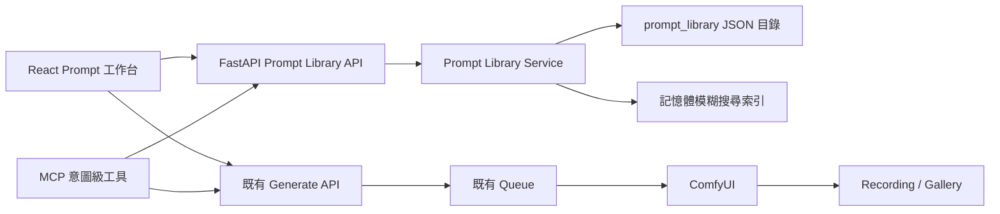

# Prompt Library 與 Prompt 工作台設計

- 日期：2026-07-17
- 狀態：設計已逐段核准，待使用者審閱本文件
- 目標分支：`codex/prompt-library-workbench`

## 1. 背景

目前使用者可以透過 agent、workflow template 與 style preset 產圖，但若要自行組 prompt，仍需反覆查詢 tag。專案雖已有 `prompt_templates` 模組，實際上只有三個硬編碼模板與變數替換，缺少可持續擴充的分類、持久化 CRUD、搜尋、前端工作台與 MCP 工具。

本功能要提供一個專案本地、可由 Git 追蹤並可整包複製分享的 Prompt Library。使用者與 agent 具備相同能力，可以新增、查詢、修改、歸檔與組合正負 prompt；組合結果可單純複製，也可選擇既有文字生圖 workflow 並直接送到 ComfyUI。

專案不區分登入使用者。每個 ai-drawing project instance 只有一份 Prompt Library；跨 instance 分享方式是複製或合併資料夾中的 JSON 檔。

## 2. 目標與非目標

### 2.1 目標

- 固定兩層資料結構：分類 → 條目。
- Positive 與 Negative Prompt 使用相同能力、分開儲存。
- 所有分類都允許多選。
- 條目包含中文名稱、中文說明、英文 prompt、別名與搜尋關鍵字。
- 組合結果以英文為主，使用者可拖曳決定順序並調整每個片段的權重。
- 支援未入庫的自由文字，且能在同一介面將它新增到庫中。
- 能把正負 prompt 儲存成常用組合，再次載入編輯。
- 常用組合同時保存條目引用與文字快照；條目修正時更新所有本地引用。
- 中英文、說明、別名、關鍵字與近似拼字均可模糊搜尋。
- UI 與 agent 透過同一後端服務取得相同行為。
- 可只組合／複製 prompt，也可選擇文字生圖 workflow 後直接產圖。
- workflow 參數未覆寫時沿用 workflow 原值；Seed 永遠可選隨機。

### 2.2 非目標

- 不新增登入、帳號、權限或多租戶系統。
- 不實作 ZIP 匯入／匯出介面；分享依靠檔案複製與 Git。
- 不處理 img2img、ControlNet、inpaint、姿勢圖、遮罩或影片 workflow。
- 不為不同模型家族維護同一條目的多份 prompt 版本；使用者自行選擇合適條目。
- 不取代 style preset。Style preset 仍是模型、LoRA、workflow、完整 prompt 與參數的食譜；Prompt Library 保存可自由組合的原子片段與常用組合。
- 不新增搜尋伺服器、外部資料庫或外部工作流引擎。

## 3. 核心決策

採用「分類檔案式目錄」作為唯一資料來源：每個分類一份 JSON，常用組合各自一份 JSON。Backend 提供 typed provider、驗證、索引、組合與安全寫入；React 與 MCP 都不直接修改檔案。

相較於單一大 JSON，此設計降低 Git merge conflict 與單檔損壞範圍；相較於 SQLite，再次分享與人工檢視不需要額外 export／sync 流程。



## 4. 資料夾結構

```text
prompt_library/
├── manifest.json
├── positive/
│   ├── subjects.json
│   ├── appearance.json
│   ├── clothing.json
│   ├── actions.json
│   ├── camera-angles.json
│   └── ...
├── negative/
│   ├── quality.json
│   ├── anatomy.json
│   ├── text-watermark.json
│   └── ...
└── combinations/
    ├── portrait-dress.json
    └── ...
```

`manifest.json` 只保存 library 層資訊與 schema version，不重複維護分類清單。分類由 `positive/*.json` 與 `negative/*.json` 掃描取得，排序由各分類的 `order` 決定。

所有檔案皆使用 UTF-8、結尾換行與穩定縮排，方便 Git diff 與人工修改。

## 5. JSON 資料模型

### 5.1 Manifest

```json
{
  "schema_version": 1,
  "library_id": "default",
  "name": "AI Drawing Prompt Library",
  "description_zh": "專案共用的正負 Prompt 詞庫與常用組合"
}
```

### 5.2 分類與條目

```json
{
  "schema_version": 1,
  "id": "clothing",
  "polarity": "positive",
  "name_zh": "服裝",
  "description_zh": "角色穿著、服裝類型與服裝細節",
  "aliases": ["穿著", "outfit"],
  "keywords": ["衣服", "wardrobe"],
  "order": 30,
  "revision": 1,
  "archived": false,
  "entries": [
    {
      "id": "dress",
      "name_zh": "連身裙",
      "description_zh": "一件式裙裝",
      "prompt": "dress",
      "aliases": ["洋裝", "one-piece dress"],
      "keywords": ["裙裝", "skirt outfit"],
      "order": 10,
      "revision": 1,
      "archived": false
    }
  ]
}
```

規則：

- `id` 使用穩定的 kebab-case slug；名稱或 prompt 修正時不得自動改 ID。
- 資料夾 polarity 與檔內 `polarity` 必須一致。
- 分類檔 `revision` 在該檔任何成功修改後遞增。
- 條目 `revision` 只在該條目內容修改後遞增，供常用組合追蹤。
- `aliases` 是同義名稱；`keywords` 是額外搜尋線索。兩者都可包含中英文。
- `archived=true` 的分類或條目不出現在一般瀏覽與搜尋中，但仍可被舊組合引用。

### 5.3 常用組合

```json
{
  "schema_version": 1,
  "id": "portrait-dress",
  "name_zh": "連身裙正面人像",
  "description_zh": "常用的人像構圖",
  "aliases": ["洋裝人像"],
  "keywords": ["portrait", "dress"],
  "revision": 1,
  "archived": false,
  "legacy_template": false,
  "positive": [
    {
      "kind": "literal",
      "ref": null,
      "snapshot": "1girl",
      "source_revision": null,
      "weight": 1.0,
      "order": 10
    },
    {
      "kind": "entry",
      "ref": {
        "polarity": "positive",
        "category_id": "clothing",
        "entry_id": "dress"
      },
      "snapshot": "dress",
      "source_revision": 1,
      "weight": 1.2,
      "order": 20
    }
  ],
  "negative": [
    {
      "kind": "entry",
      "ref": {
        "polarity": "negative",
        "category_id": "quality",
        "entry_id": "low-quality"
      },
      "snapshot": "low quality",
      "source_revision": 1,
      "weight": 1.0,
      "order": 10
    }
  ],
  "positive_prompt_snapshot": "1girl, (dress:1.2)",
  "negative_prompt_snapshot": "low quality"
}
```

常用組合不保存 workflow、checkpoint、LoRA 或生圖參數。`ref` 找不到時仍使用 `snapshot`；`source_revision` 落後或目前條目的 `prompt` 與 snapshot 不同時，使用目前條目內容並修復 snapshot。比較 prompt 文字可涵蓋使用者手動修改 JSON、但忘記遞增 revision 的情況。

`legacy_template` 預設為 `false`。只有遷移自舊 `prompt_templates` 的三個內建模板設為 `true`，供 legacy list/apply adapter 篩選；一般常用組合不會出現在 legacy API。

## 6. Prompt 組合規則

- Positive 與 Negative 各自擁有一條有序片段列。
- 使用者拖曳後的順序是唯一輸出順序，不再按分類重新排序。
- 所有分類均可多選。
- 相同 `ref` 在同一 polarity 只出現一次；再次選取時聚焦已存在的片段。
- 自由文字使用 `kind=literal`，可獨立存在，也可從工作台另存為條目。
- 片段只做外圍空白清理，不擅自翻譯或改寫英文內容。
- `weight=1.0` 時輸出原文；其他權重輸出為 `(fragment:weight)`。
- 最終片段以 `, ` 串接。空片段不輸出。
- Compose response 同時回傳最終正負 prompt、使用到的 refs、warnings 與是否發生 snapshot repair。

## 7. 模糊搜尋

搜尋在 backend 統一執行，UI 與 agent 得到一致結果。索引涵蓋條目、分類與常用組合。

### 7.1 正規化

- Unicode NFKC 正規化。
- 英文轉小寫。
- 連續空白與常見分隔符正規化。
- 保留中文字元；中文單字查詢仍允許 exact／substring match。

### 7.2 欄位權重

- `name_zh`、`prompt`、`aliases`：1.0。
- 常用組合的 `positive_prompt_snapshot`、`negative_prompt_snapshot`：0.9。
- `keywords`：0.9。
- `description_zh`：0.75。
- 分類名稱、分類說明：0.6。

### 7.3 排名順序

1. 正規化後完全相符：100。
2. 名稱、alias 或 prompt 的前綴／完整 token 相符：90。
3. 任一欄位包含查詢文字：80。
4. Token overlap 與近似拼字：依相似度與欄位權重計為 0–79。

預設 fuzzy threshold 為 45、limit 為 50；呼叫端可覆寫。相同分數依 polarity、分類 `order`、條目 `order`、中文名稱與 ID 穩定排序。

回傳至少包含 `score`、`matched_fields`、polarity、category、resource type 與顯示摘要。一般搜尋排除 archived；診斷／管理模式可明確包含。

每次成功寫入後局部重建索引；外部複製檔案進目錄時，provider 以檔案 mtime 變化重新載入。詞庫預期為數百至數千筆，不使用 Elasticsearch 或資料庫索引。

## 8. Backend 元件

### 8.1 `PromptLibraryProvider`

Protocol 定義 catalog、category、entry、combination 的 list/get/search/save/archive/compose。測試可注入 in-memory provider；正式環境使用 `FilePromptLibraryProvider`。

### 8.2 `FilePromptLibraryProvider`

- 掃描並驗證 JSON。
- 快取合法分類與組合，追蹤 mtime。
- 對每個來源檔以原始 UTF-8 bytes 計算完整 SHA-256 `etag`，讓 API 偵測未遞增 revision 的外部複製或人工修改。
- 單一檔案損壞時隔離該檔並回報 diagnostics，不阻斷其餘資料。
- 提供穩定排序與 typed domain objects。

### 8.3 `PromptSearchIndex`

- 建立正規化欄位與 weighted candidates。
- 提供 deterministic ranking、matched field 與 score。
- 搜尋條目、分類及常用組合。

### 8.4 `PromptComposer`

- 解析 refs、snapshot 與 source revision。
- 套用順序、權重與格式化規則。
- 產出正負 prompt 與 warnings。

### 8.5 `PromptLibraryWriteCoordinator`

- 使用 `prompt_library/.lock` 的單一跨 process 寫入鎖與有限等待時間。
- 要求呼叫端對既有檔案提供 `expected_revision` 與 `expected_etag`；任一不符即回 `409 revision_conflict` 或 `409 external_change`。建立新的 category／combination 檔時傳 revision `0` 且 etag 為空。
- Category mutation 的 `expected_revision` 對應 category 檔 revision。建立、更新或歸檔 entry 時，一律以父 category 檔目前 revision 作為 concurrency token；成功 response 另外回傳新的 category revision 與 entry revision。Combination mutation 使用 combination revision。
- 先在目標同層建立 temporary file，完整驗證後 flush、fsync 並 atomic replace。
- 條目修改時先 atomic replace category 檔，再在同一 lock 中 eager 更新引用它的組合與最終快照。若 process 在多檔更新途中終止，category 是新的真實來源。
- 每次載入／compose 組合時再次比較 `source_revision` 與 snapshot 文字，作為 crash 或外部檔案修改後的 lazy repair。

## 9. FastAPI 契約

新 route prefix 為 `/api/prompt-library`。主要端點：

| Method | Path | 用途 |
|---|---|---|
| GET | `/catalog` | 分類摘要與 diagnostics |
| GET | `/categories/{polarity}/{category_id}` | 取得分類與條目 |
| GET | `/search` | 模糊搜尋分類、條目與常用組合 |
| PUT | `/categories/{polarity}/{category_id}` | 建立或更新分類 |
| PUT | `/categories/{polarity}/{category_id}/entries/{entry_id}` | 建立或更新條目 |
| POST | `/archive` | 歸檔 category、entry 或 combination |
| POST | `/compose` | 解析有序片段並回傳正負 prompt |
| GET | `/combinations` | 列出常用組合 |
| GET | `/combinations/{combination_id}` | 取得常用組合並執行 lazy repair |
| PUT | `/combinations/{combination_id}` | 建立或更新常用組合 |

所有錯誤遵循 agent-friendly `code + message + hint`。建立 category／combination 使用 `expected_revision=0` 且不傳 etag；entry create/update/archive 與其他 update/archive 使用所屬檔案最後讀到的 revision 與 etag。寫入 response 回傳新 revision、新 etag、受影響組合與索引更新狀態。

既有 `/api/prompt-templates` 保留為 legacy adapter。三個內建模板遷移到 versioned combination JSON；legacy list/apply 由同一 provider 讀取，避免維護第二套硬編碼來源。

## 10. MCP 工具

新增四個意圖級工具：

1. `prompt_library_search`：列出或模糊搜尋分類、條目、常用組合；空 query 可列出 catalog。
2. `prompt_library_save`：以 `resource_type` discriminated payload 建立或更新 category、entry、combination；新 category／combination 傳 `expected_revision=0`，entry 則傳父 category revision；既有檔案同時傳 API 回傳的 etag。
3. `prompt_library_compose`：組合正負有序片段、權重與自由文字，選擇是否同時保存為常用組合。
4. `prompt_library_archive`：帶目前 revision／etag 明確歸檔資源，不做一般永久刪除。

MCP 工具不直接讀寫檔案，全部呼叫 backend API。Payload 使用短 ID 與單筆資源欄位，不要求 agent 搬運完整 catalog JSON。

直接產圖沿用既有 `generate_image`；agent 流程為：

```text
prompt_library_search
→ prompt_library_compose
→ generate_image（使用回傳的 positive / negative prompt）
```

## 11. Frontend 工作台

現有 `/generate` 升級為 `PromptWorkbench`，導航文字改為「Prompt 工作台」；不建立另一個功能重疊的生圖頁面。Dashboard 卡片同步更新。

主要元件邊界：

- `PromptWorkbench`：頁面狀態與整體協調。
- `LibrarySidebar`：Positive／Negative、分類、排序與管理入口。
- `EntryBrowser`：模糊搜尋、結果說明、多選與 inline add。
- `CompositionBoard`：正負片段、拖曳、權重、自由文字與最終預覽。
- `CombinationPicker`：搜尋、載入、儲存與更新常用組合。
- `GenerationPanel`：workflow 與 generation overrides，可收合。
- `EntryEditorModal`／`CategoryEditorModal`：新增、修改與 revision conflict 處理。
- `usePromptLibrary`：集中 API 狀態、debounce、cache invalidation 與錯誤格式化。

互動規則：

- 中央搜尋結果加入目前 active polarity 的組合列。
- 「將搜尋文字新增到庫」會預填 prompt 或中文名稱，但仍要求選擇分類並確認雙語欄位。
- Positive 與 Negative 同時可見；各自提供複製按鈕。
- 載入常用組合只修改正負片段、順序與權重，不修改 workflow 或生圖參數。
- 生圖面板收合時，頁面可純粹作 Prompt Builder 使用。
- 提交後保留所有 builder 與 generation state，沿用既有 job id、queue polling 與 Gallery recording。

## 12. Workflow 與直接生圖整合

只列出 manifest 標記為 image modality、且 `io`／conditioning 不需要圖片、遮罩、姿勢或影片輸入的 text-to-image workflow。沒有合法 manifest 的 template 不出現在工作台選單，但既有 API 仍可直接使用它。

Workflow catalog 新增 generation form descriptor，回傳：

- workflow ID、顯示名稱、model family 與 modality。
- 支援的可覆寫欄位。
- 從 workflow JSON 讀出的原始預設值。
- checkpoint、LoRA、diffusion model、text encoder、VAE 等可用資源選項。
- sampler 與 scheduler 的合法選項；優先取 ComfyUI live capability，無法連線時退回 workflow 目前值與 backend 已知選項。

工作台可調欄位包含 checkpoint、單一／多 LoRA、steps、CFG、width、height、batch size、sampler、scheduler、diffusion model、text encoder、VAE 與 denoise。Template 不支援的欄位標記為 unavailable，不送入 request。

`GenerateRequest` 增加向後相容的 `use_workflow_defaults` 模式：

- `false` 或省略：維持既有呼叫者的 defaults 與行為。
- `true`：只有呼叫端明確覆寫的欄位才注入 workflow；未提供欄位保留 template 值。

新增 optional `seed_mode` 欄位。舊呼叫者省略 `seed_mode` 時維持目前 seed 行為；`use_workflow_defaults=true` 時必須明確提供下列其中一種模式：

- `workflow_default`：不覆寫 workflow 內 seed。
- `random`：queue 每次產生新 seed。
- `fixed`：必須提供合法整數 seed。

`fixed` 以外的模式若同時提供 seed，或 `fixed` 未提供 seed，回 `422 invalid_seed_mode`。Prompt 工作台永遠顯示 random 選項。UI 在使用 workflow 預設時完全省略該 override，不以 `null` 模糊表示。

## 13. 一致性、錯誤與安全

- 本功能無登入；project instance 內所有呼叫者共用同一 library。
- 所有路徑由受控 root 加 slug ID 組成，resolve 後必須仍位於 `prompt_library/` 下，阻止 path traversal。
- 非法 JSON、schema mismatch、重複 ID、polarity mismatch、revision conflict 與 etag mismatch 不得覆寫原檔。
- 單檔錯誤不阻斷其他合法資料，catalog diagnostics 回傳檔名、JSON path、message 與 hint。
- 一般 UI 與 MCP 不提供永久刪除；archive 後引用該條目的組合繼續使用 snapshot 並回 warning。
- 找不到 ref 不阻擋 compose；使用 snapshot 並回 `missing_reference`。
- Generation 失敗沿用 queue 的結構化錯誤；Prompt 工作台狀態不清空。
- 外部手動合併 JSON 後若出現衝突，provider 顯示 diagnostics，不自行猜測或覆寫。

## 14. 初始詞庫

第一版提供約 300–450 個常用條目。一般分類約 10–25 個；服裝、動作、姿勢等大型分類可達 30–40 個。全部具備中文名稱、中文說明、英文 prompt、aliases／keywords 與穩定 ID。

Positive 初始分類：

- 人物與數量
- 外觀特徵
- 表情
- 髮型與髮色
- 服裝
- 配件
- 動作
- 姿勢
- 視角
- 景別與構圖
- 光線
- 背景與環境
- 色彩與氣氛
- 細節與品質

Negative 初始分類：

- 畫質瑕疵
- 解剖錯誤
- 手腳與肢體
- 臉部與眼睛
- 重複主體／物件
- 裁切與構圖問題
- 模糊與壓縮雜訊
- 文字、Logo 與浮水印

詞庫內容不宣稱跨模型等效；使用者自行挑選適合目前 workflow 的英文片段。

## 15. 測試策略

### 15.1 Backend

- Manifest、category、entry、combination schema 驗證。
- UTF-8、invalid JSON、重複 ID、polarity mismatch 與 path traversal。
- Cross-process lock、atomic replace、revision conflict 與原檔保留。
- 條目修改後 eager propagation，以及載入時 lazy snapshot repair。
- Compose 的順序、權重、自由文字、duplicate ref 與 missing ref fallback。
- 模糊搜尋的中英文 exact、prefix、substring、description、alias、keyword、近似拼字、filter、archived exclusion 與穩定排序。
- FastAPI catalog/search/save/archive/compose/combination contract。
- `use_workflow_defaults`、seed mode 與 form descriptor。

### 15.2 MCP

- 四個工具與 `tool_catalog.py` 註冊一致。
- 每個工具的成功、validation error、revision conflict、missing ref 與 backend unavailable 回應。
- Agent 完整流程：新增分類／條目 → 搜尋 → 組合 → 儲存常用組合 → 修改條目 → 驗證組合更新。
- Compose 結果可直接傳給既有 `generate_image`。

### 15.3 Frontend

- Catalog 載入、polarity 與分類切換。
- Debounced fuzzy search 與命中欄位顯示。
- 多選、duplicate ref 聚焦、拖曳排序、權重與自由文字。
- Inline add、category／entry edit、archive 與 revision conflict UI。
- 常用組合儲存、載入、更新與不修改 generation state。
- Positive／Negative clipboard。
- Workflow form descriptor、所有 overrides、workflow default、省略 payload 欄位與 random／fixed seed。
- Submit 成功、失敗與保留工作台狀態。

### 15.4 整合與人工驗證

- CI 使用 mock ComfyUI，不依賴實機服務。
- 執行 backend、MCP 與 frontend 全部既有回歸測試。
- 本機啟動 backend + frontend，完成純 prompt copy smoke。
- 本機啟動 ComfyUI，選一個 text-to-image workflow，驗證 workflow defaults、random seed、固定 seed、override 參數、queue、Gallery 與 recording。

## 16. 向後相容與交付

- 新增 Prompt Library 不需要 DB migration。
- 舊 `prompt_templates` 三個硬編碼模板遷移為 versioned combination JSON；legacy API 保留。
- Style preset、Civitai、Gallery、LoRA 與 custom workflow API 不改變。
- Frontend `GenerateRequest` 型別同步目前 backend 已有欄位，再加入 workflow-default 與 seed mode。
- `.superpowers/` 加入 `.gitignore`，視覺 brainstorm mockup 不提交。
- `prompt_library/.lock` 是 runtime 檔案並由 `.gitignore` 排除。
- 實作完成後同步更新 `docs/PROGRESS.md`。

本設計是一個單一、內聚的功能，但 implementation plan 應按依賴拆成五個可驗證階段：file provider／schema／初始詞庫、API 與搜尋組合服務、MCP parity、React 工作台、workflow-default generation 整合與全系統回歸。每階段均需保持既有測試可通過，避免一次性跨層大改。

## 17. 成功條件

1. 新 clone 啟動後即可看到初始正負詞庫。
2. 使用者可以完全不輸入英文，靠搜尋、多選、排序與權重得到正負 prompt。
3. 使用者也可以加入自由文字，並在同一頁將其存入 library。
4. 條目修正後，引用它的常用組合在再次讀取時一定反映新內容。
5. 複製 `prompt_library/` 到另一個 project instance 後可被直接載入；非法檔案有可修復 diagnostics。
6. UI 與 MCP 都能完成同一套查詢、建立、修改、歸檔、組合與常用組合流程。
7. 純 Prompt Builder 不依賴 ComfyUI。
8. 直接生圖能保留 workflow 未覆寫值，並能明確選擇 random seed。
9. 生圖完成後仍走既有 queue、recording 與 Gallery 資料流。
10. 全部既有回歸測試與新增測試通過，並完成一次本機 ComfyUI smoke test。
